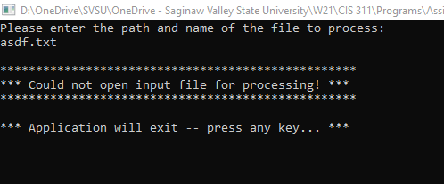
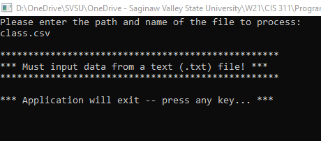
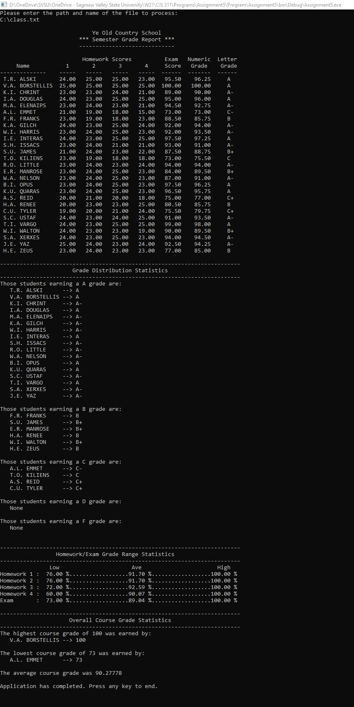

# Grade-Report-System-using-LINQ
Reads in a text file and then organizes and displays students' grades in a console window. All calculations are completed using LINQ.

Error handling - nonexistent file:

Error handling - wrong file type:

Successful run:

